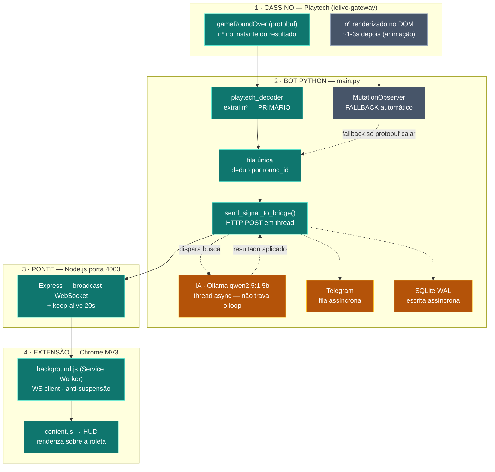

# 🚀 Otimizações de Performance — Einstein Roulette AI HUD

> Registro técnico das otimizações aplicadas em **27–28/06/2026**.
> Objetivo: eliminar o atraso na transmissão de sinais, o congelamento de
> threads no bot Python e a lentidão/invisibilidade do HUD no Chrome — e, na
> fase 2, **extrair o número direto do stream protobuf da Playtech** com o
> MutationObserver como fallback automático.

---

## 🎯 Diagnóstico central

O gargalo **não era a detecção do número** — era o **trem síncrono que rodava
depois dela**, dentro do mesmo `while True` do loop principal.

A cada giro detectado, o loop bloqueava em série em:

```
db.save_number()          → SQLite síncrono (connect + fsync)
bot.enviar_imediato()     → HTTP Telegram, timeout 5s
run_engine() → is_available() → client.list() (round-trip HTTP)
run_engine() → Ollama chat()  → inferência 1–5s (1ª paga o load do modelo)
bot.enviar(msg_completa)  → HTTP Telegram, timeout 10s
```

**Bloqueio acumulado: ~7–15 s por giro.** A thread de captura continuava
pegando números (não se perdiam), mas o sinal chegava atrasado ao HUD e o
sistema parecia "congelar".

**Resultado final: o bloqueio do loop por giro caiu para alguns milissegundos.**

---

## 🗺️ Arquitetura — fluxo do sinal (detecção HÍBRIDA)

O número entra por **duas fontes** e o sistema escolhe a melhor sozinho:
**protobuf** (primário, mais rápido e preciso) e **DOM/MutationObserver**
(fallback automático). Daí desce pela **espinha** do sinal. O que antes travava
o loop — IA, Telegram, SQLite — virou **ramificação assíncrona** que não segura
a chegada do próximo número.



**Legenda:** **teal sólido** = caminho primário do sinal (protobuf → HUD, ~ms) ·
**cinza tracejado** = fallback DOM (só entra se o protobuf calar) ·
**âmbar tracejado** = canal assíncrono (roda em paralelo, não trava o loop).

---

## 🛰️ FASE 2 — Detecção via protobuf (engenharia reversa, 28/06/2026)

### O que foi feito
Em vez de ler o número da **tela renderizada** (DOM), passamos a extraí-lo
direto do **stream binário** que o navegador já recebe do gateway ao vivo da
Playtech (`wss://ielive-gateway.ptielive.com/ws`). Os frames são **Protocol
Buffers binários, sem criptografia** — 100% decodificáveis com um parser wire
cru (sem `.proto`).

### Como o número foi cravado
Capturamos **2194 frames reais** (49 rodadas) de uma sessão ao vivo e
decodificamos. O número sorteado vem em:
- **`gameRoundOver/1.0` → campo `#3.16.3.1.2`**, codificado como `100 + número`
  (offset-100). Ex.: raw `135` → número `35`.
- `GameEventRequest` (`#3.118.1`) replica o mesmo valor — **validação cruzada**.

### Validação independente (decisivo)
A sequência extraída do protobuf foi cruzada com os números que o
**MutationObserver salvou no banco na mesma sessão**:
- **98% idênticas, 48 números iguais em sequência.**
- A **única** divergência foi o DOM ter um número **a mais** (leitura dupla do
  observer) — que o protobuf, com `round_id` único, **não comete**.
- Conclusão: o protobuf não só está correto, é **mais preciso** que o DOM.

### Integração (modelo híbrido)
- **Primário** — `core/monitor.py::_ingest_ptielive_frame()` decodifica cada
  `gameRoundOver` recebido e empurra o número (dedup por `round_id`) na **mesma
  fila** que o DOM já usava. Acontece **antes** da animação renderizar.
- **Fallback** — `_push_spin()` (DOM) só entra se o protobuf ficar em silêncio
  por mais de `PROTOBUF_HEALTHY_WINDOW` (12s). Loga a transição
  (`⚠️ [Fallback] Protobuf em silêncio…`) e volta sozinho ao normal.
- **Decodificador** — `core/playtech_decoder.py` (standalone, sem deps): parser
  wire + `extract_roulette_number()` + `parse_frame()`.

### Config (`config/settings.py`)
- `PROTOBUF_PRIMARY` (env, default `True`) — liga a fonte protobuf.
- `PROTOBUF_HEALTHY_WINDOW` (env, default `12`s) — janela de supressão do DOM.
- `CAPTURE_PTIELIVE_FRAMES` (env, default `True`) — grava frames crus em
  `logs/ptielive_frames.jsonl` (só para análise offline; pode desligar em prod).

### Ferramentas de apoio
- `tools/pb_correlate.py` — cruza frames capturados com números ground-truth e
  **crava automaticamente** qual campo é o número (usado para descobrir o campo).

### Testes (todos passaram)
Extração das 49 rodadas com `round_id` único · supressão do DOM com protobuf
vivo · fallback do DOM no silêncio do protobuf · dedup ao reingerir frames.

---

## 🐍 A) Bloqueio do Main Thread (Python)

### A1. Telegram assíncrono — `services/bot.py`
- **Problema:** `enviar()` / `enviar_imediato()` faziam `requests.post()`
  SÍNCRONO no loop (timeout 5–10s). Cada giro podia travar segundos esperando
  o round-trip da API do Telegram.
- **Solução:** os envios agora apenas **enfileiram** (operação O(1)) e um worker
  dedicado em background drena a fila e faz o POST. API pública preservada.
  Adicionados `enviar_blocking()` (envio garantido para o relatório de
  encerramento) e `flush()` (drena a fila antes de sair).

### A2. SQLite WAL + escrita assíncrona — `storage/database.py`
- **Problema:** abria/fechava uma conexão a cada chamada e fazia `fsync` no
  commit (I/O de disco síncrono no hot path).
- **Solução:** conexão única persistente com `PRAGMA journal_mode=WAL` +
  `synchronous=NORMAL` (remove o fsync caro), e `save_number`/`save_result`/
  `log_error` gravam via **fila numa thread de escrita dedicada**. Leituras
  continuam síncronas sob lock (são raras e ficam fora do loop quente).

### A3. Logger idempotente — `utils/logger.py`
- **Problema:** `setup_logger` era chamado a cada import e **empilhava handlers
  duplicados** → cada linha de log era escrita N vezes em disco.
- **Solução:** idempotente (não duplica handlers), `propagate=False`,
  `delay=True` no `RotatingFileHandler`.

### A4. Shutdown seguro — `main.py` / `main_playtech.py`
- `bot.flush()` e `db.flush()` no encerramento (não perde os últimos números
  nem mensagens pendentes).
- Relatório final via `bot.enviar_blocking()` (a fila async poderia não drenar
  antes do processo morrer).

---

## 🎭 B) Latência do Playwright (detecção)

### B1. Detecção PUSH event-driven — `core/monitor.py`
- **Problema:** o `watch()` fazia polling com `evaluate` (round-trips CDP) +
  `time.sleep(0.5–1s)`.
- **Solução:** o **MutationObserver continua existindo** (não foi removido!),
  mas agora, em vez de levantar uma flag para o Python ficar perguntando, ele
  chama `window.antigravityPush(numero)` via `context.expose_binding`,
  **empurrando** o número direto para uma fila em memória no Python. O `watch()`
  só drena essa fila (**zero round-trip CDP** no caminho feliz). O polling antigo
  permanece como fallback automático.
- **Bônus:** o `evaluate` de fallback foi colapsado de **3 round-trips → 1**.

### B2. Cache do crupiê — `core/monitor.py`
- **Problema:** `get_current_dealer()` era chamado 2×/giro e varria até 8
  seletores em todos os frames (dezenas de round-trips CDP por número).
- **Solução:** cache com TTL de 30s (o crupiê muda a cada ~20–40 min, não a
  cada giro).

### B3. Loop mais responsivo — `main.py`
- Sleeps de detecção reduzidos de 1s/0.5s → **0.2s** (barato agora que a
  detecção é push e cada `watch` não custa CDP).

---

## 🧠 C) Tempo de inferência do Ollama (IA)

### C1. IA fora do loop — `core/async_strategy.py` (novo) + `main*.py`
- **Problema:** `run_engine()` (com Ollama) rodava **síncrono** no loop.
- **Solução:** `AsyncStrategySearcher` roda `run_engine()` numa thread
  (`submit()` retorna na hora); o loop só **consome** o resultado via `poll()`
  no topo da iteração. **Toda mutação do estado da aposta continua na thread
  principal** (padrão produtor/consumidor) → zero race condition. `single-flight`
  evita empilhar IA para o mesmo intervalo de giros.

### C2. Disponibilidade cacheada + opções enxutas — `ai/ollama_agent.py`
- **Problema:** `is_available()` refazia `client.list()` (round-trip HTTP)
  **antes de toda inferência**, mesmo já conectado.
- **Solução:** cacheia o estado positivo (só uma falha real reseta). Opções
  apertadas: `num_predict 150→90`, `+top_k:20`, `num_ctx:1536`,
  `stop:["}\n","```"]` para encerrar assim que o JSON fecha.
- **Preload:** modelo pré-carregado na memória no startup (a 1ª inferência não
  paga mais o custo de load do modelo ao vivo).

### C3. SmartBrain thread-safe — `ai/smart_brain.py` + `server/services/engine.py`
- **Problema:** com a IA em thread, havia corrida no dict de crupiês
  (`dict changed size during iteration` no save).
- **Solução:** `threading.RLock()` + método `sync_croupier_history()`
  thread-safe; `get_croupier_tracker()` e `save_croupier_profiles()` guardados.

---

## 🧩 D) Extensão Chrome (MV3)

### D1. Anti-suspensão do Service Worker — `bridge/server.js` + `background.js` + `manifest.json`
- **Problema (causa do "sinal atrasado"):** o service worker MV3 era **suspenso
  após ~30s de inatividade**. Ao dormir, o WebSocket com a ponte caía; sinais
  que chegavam nesse intervalo eram transmitidos para zero clientes. Sintoma
  visível: `Conectado à ponte` repetindo a cada ~30s no console do HUD.
- **Solução (3 frentes):**
  1. **`server.js`** envia `{type:"ping"}` a cada **20s** → receber mensagem WS
     reseta o timer de inatividade do worker (Chrome 116+) → ele **não dorme**.
     Também: heartbeat ping/pong para limpar sockets mortos e **replay do último
     sinal** para quem reconectar (cobre micro-gaps).
  2. **`background.js`** ignora o ping (não vira sinal falso) + backstop via
     `chrome.alarms` (acorda a cada ~24s e reconecta se o socket caiu).
  3. **`manifest.json`** ganhou a permissão `alarms`.

### D2. Broadcast direcionado — `background.js`
- **Problema:** `chrome.tabs.query({})` varria **todas as abas a cada sinal**
  (e `status_tick` dispara a cada giro).
- **Solução:** rastreia só as abas com HUD ativo (via porta keep-alive) e
  transmite apenas para elas.

### D3. Deduplicação por timestamp — `content.js`
- O replay-on-connect (ou qualquer rebroadcast) não processa o mesmo sinal
  duas vezes nem toca o som repetido. Cada envio do Python tem timestamp único.

### D4. Renderização do HUD por tamanho de frame — `content.js`
- **Problema:** o HUD é desenhado **dentro do iframe do jogo** (por isso aparece
  sobre a roleta). Uma restrição anterior a "só frame de topo" deixou o HUD
  atrás do iframe, invisível (só o som tocava).
- **Solução:** renderiza no frame de topo e nos frames grandes (jogo), pulando
  apenas iframes minúsculos (< 320px) de tracking/anúncio. Mantém o HUD visível
  e ainda evita HUDs duplicados em frames inúteis.

---

## ⏱️ Latência: antes × depois

| Etapa por giro            | Antes (síncrono no loop)   | Depois                       |
|---------------------------|----------------------------|------------------------------|
| Detecção do número        | polling + sleep 0.5–1s     | **push event-driven (~0ms)** |
| Crupiê                    | ~8 seletores × frames, 2×  | **cache (≈0)**               |
| Salvar no SQLite          | connect + fsync síncrono   | **fila async (≈0)**          |
| Telegram (×2–4)           | 5–10s síncrono cada        | **fila async (≈0)**          |
| IA Ollama                 | 0.6–5s **bloqueando**      | **thread separada (não bloqueia)** |
| **Bloqueio total/giro**   | **~7–15 s**                | **alguns ms**                |

---

## 📁 Arquivos alterados

**Python (bot):**
- `utils/logger.py` — logger idempotente
- `services/bot.py` — Telegram assíncrono
- `storage/database.py` — SQLite WAL + escrita async
- `ai/ollama_agent.py` — disponibilidade cacheada + opções + preload
- `ai/smart_brain.py` — lock thread-safe
- `core/monitor.py` — push event-driven + cache de crupiê
- `core/async_strategy.py` — **(novo)** buscador de estratégia assíncrono
- `server/services/engine.py` — usa `sync_croupier_history()` thread-safe
- `main.py` — wiring async + shutdown seguro + sleeps menores
- `main_playtech.py` — wiring async + preload + shutdown seguro

**Extensão / Ponte:**
- `chrome-extension/manifest.json` — permissão `alarms`
- `chrome-extension/background.js` — keep-alive + broadcast direcionado
- `chrome-extension/content.js` — dedup por timestamp + render por tamanho
- `bridge/server.js` — keep-alive 20s + heartbeat + replay-on-connect

---

## ▶️ Como rodar e verificar

1. **Ponte:** `cd bridge && node server.js`
   (resposta do endpoint deve conter `delivered`, não `signal` — confirma a
   versão nova).
2. **Bot:** `python main.py` (entrypoint visual — DOM/MutationObserver).
3. **Extensão:** `chrome://extensions` → **Recarregar** (aceitar a permissão
   `alarms`).

**Sinais de que está tudo certo:**
- O `Conectado ao servidor da ponte!` aparece **uma vez e para** (sem reconectar
  a cada 30s).
- O HUD aparece **sobre a roleta** (um só painel).
- O sinal de entrada chega ~1s após o giro.
- `Ctrl+C` no Python envia o relatório de encerramento.

---

## ⚠️ Notas honestas (engenharia)

1. **Entrypoint:** use **`main.py`** (GameMonitor). Agora ele roda no modo
   **híbrido**: protobuf primário + MutationObserver como fallback. Ambos foram
   otimizados e validados.

2. **`core/playtech_ws.py` (cliente WS standalone) continua sendo um beco sem
   saída** — ele tentava refazer o handshake autenticado num cliente separado.
   A solução correta (e implementada) foi **interceptar os frames da conexão que
   o navegador já tem autenticada** (`page.on("websocket") → framereceived`) e
   decodificar o protobuf ali — ver **FASE 2** acima. O `playtech_ws.py` pode
   ser ignorado/removido; quem faz o trabalho é `core/playtech_decoder.py` +
   o hook em `core/monitor.py`.

   ⚠️ **Fragilidade:** se a Playtech mudar o schema protobuf, a extração pode
   quebrar **em silêncio** (número errado). Por isso o fallback DOM existe — mas
   vale conferir os logs `🎯 [Protobuf]` de tempos em tempos.

3. **SmartBrain em thread:** blindado com lock no dict de crupiês. Se notar
   qualquer inconsistência em pesos Q-Learning, dá para estender o lock.

4. **Realidade do produto (não é otimização):** essas mudanças deixam o sistema
   mais rápido e estável (não perde a janela de aposta, HUD sincronizado), mas
   latência não altera a vantagem da casa na roleta europeia — os giros são
   independentes. Isto é sobre o que o software entrega, não sobre lucro.
